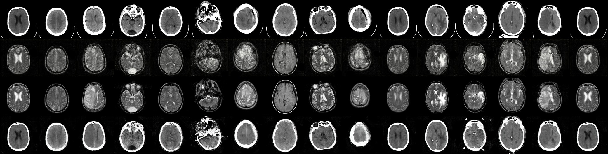

# CT to MRI Bidirectional Conversion using CycleGAN

This project was developed as part of the **final project (CSD416 and CSD415)** of **KTU, Kerala Technological University**.

It demonstrates the use of Generative Adversarial Networks (GANs) for the complex task of converting CT scans to MRI scans and vice versa. The core part of the project is presented in this repository, which includes utilities for training the model and files for running inference on the trained model.

The project serves as an experiment to investigate the potential of using CycleGANs for medical imaging tasks, and the results achieved here provide insights into the feasibility of such techniques in healthcare applications.

An electron based GUI interface to infer this model can be found at [cyclegan-gui](https://github.com/devadathanmb/cyclegan-gui).

## Table of Contents

- [Project Overview](#project-overview)
- [Setup](#setup)
- [Usage](#usage)
- [Sample Results](#sample-results)
- [Team Members](#team-members)
- [Acknowledgments](#acknowledgments)
- [License](#license)

## Project Overview

The core side of the project involves:

- **Train folder :** Contains all utilities and scripts necessary for training the CycleGAN model.
- **Root directory :** Includes files and scripts for running inference using the trained model.

## Setup

This project is managed using [Poetry](https://python-poetry.org/), a dependency management tool for Python projects.

1. Clone the repository:

   ```shell
   git clone https://github.com/devadathanmb/cyclegan-core.git
   cd cyclegan-core/
   ```

2. Install dependencies using Poetry:

   ```shell
   poetry install
   ```

3. Activate the virtual environment:

   ```shell
   poetry shell
   ```

## Usage

To train the model, navigate to the `train/` directory and follow the instructions in the relevant jupyter notebook.

### Inference

To perform inference using the model, use the provided script as follows:

1. Make sure the virtual environment is activated using Poetry:

   ```shell
   poetry shell
   ```

2. Download the model from [this link](https://drive.google.com/file/d/1EJRA8V4mjjwKFvBwC9H-92e4Wea5sD-H/view?usp=sharing) and place it in the root directory of the project

3. Run the inference script using the following command:

   ```shell
   poetry run python inference.py --target-scan-type mri --input-file input-ct.png --output-file output-mri.png
   ```

   In this example, the model converts a CT scan (`input-ct.png`) to an MRI scan and saves the output to `output-mri.png`.

   - `--target-scan-type`: Specify the target scan type (`mri` or `ct`).
   - `--input-file`: Specify the input file path (e.g., `~/Pictures/ct.png`).
   - `--output-file`: Specify the output file path (e.g., `~/Pictures/mri.png`).

## Sample Results



This is a sample result of the model after final training.

1. **First Row :** Real CT images
2. **Second Row :** Generated MRI images of corresponding first row images
3. **Third Row :** Real MRI images, each corresponding to first row CT images
4. **Fourth Row :** Generated CT images, each corresponding third row images

## Team Members

Asif J  
Devadathan M B  
Eldose Joy  
Rishi Raj K

## Acknowledgments

- [CycleGAN Tutorial](https://youtu.be/yeqWzw19V04)

- [CycleGAN Paper](https://arxiv.org/abs/1703.10593)

- [DC-CycleGAN Paper](https://arxiv.org/abs/2211.01293)

## License

This project is licensed under GPL 3.0 licensing. See [LISCENSE.md](./LISCENSE.md)
